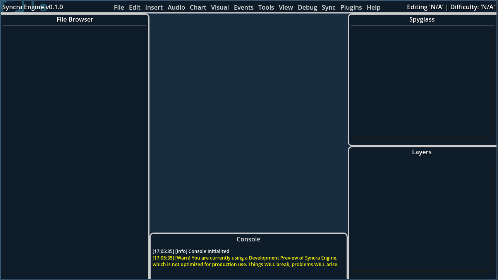

# First Steps

Assuming you have successfully installed Syncra Engine, let's get started with your first project! First of all, it's important that we look over what Syncra Engine is capable of and what it is *designed* for, compared to what it is *not* designed for.

## What Syncra Engine is Designed For

Syncra Engine is primarily designed as a Rhythm Game Level Editor, meaning it is intended to be used for creating and editing levels for rhythm games. Specifically, it is made with 4-7 Key Rhythm Games in mind, such as Stepmania, osu! and others. It is not designed for creating levels for other types of Rhythm Games, such as Muse Dash, Beat Saber, or any other rhythm game that does not use a 4-7 Key system.

## Creating Your First Project

To create your first project, open Syncra Engine and go to the `File` menu, then select `New Project`. This will bring up the Chart Wizard, which will guide you through the process of creating a new project. You will need to provide a name for your project, select a location to save it, and choose a template to use. The template will determine the default settings for your project, such as the number of keys, the BPM, and other settings.

Once you have filled out the Chart Wizard, click `Create Project` to create your new project. This will open the main editor window, where you can start creating your level.

## Understanding the Interface

When you first open Syncra Engine, you will be greeted with the main editor window. This window is where you will spend most of your time creating and editing your levels. The interface is designed to be intuitive and easy to use, with a focus on providing a smooth workflow for rhythm game level editing.

The main editor window is divided into several sections:

- **Timeline**: Located in the center, This is where you will create and edit your level. You can add notes, events, and other elements to the timeline.
- **Spyglass**: This is where you can view and edit the properties of the selected element in the timeline. You can change the properties of notes, events, and other elements here.
- **Layers**: This is where you can manage the different layers in your project. You can add, remove, and reorder layers here.
- **File Browser**: This is where you can browse and manage the files in your project. You can add, remove, and rename files here.

## Using the Timeline

!!! info
    This section is 'proof-of-concept', since the timeline is still in development. By the time it is implemented, this section will be updated to reflect the final design and functionality of the timeline.

The timeline is the heart of Syncra Engine, where you will create and edit your level. To add a note, simply click on the timeline where you want to place it. You can also drag and drop notes to move them around. To edit a note, simply click on it to select it, then use the Spyglass to change its properties, such as its type, position, and duration (if applicable).

### Adding Markers

Markers are labels that you can place on the timeline to help you keep track of important points in your level. To add a marker, right-click on the timeline and select `Add Marker`. You can then enter a name for the marker and choose a color for it. Markers can be used to mark important points in your level, such as the start of a new section or a change in the music.

### Adding Events

Events are special actions that can be triggered at specific points in your level. To add an event, right-click on the timeline and select `Add Event`. You can then choose the type of event you want to add, such as a sound effect or a visual effect. Events can be used to create dynamic and interactive levels that respond to the player's actions.

Syncra Engine comes with a variety of built-in events, such as sound effects, visual effects, and gameplay markers. You can also create your own custom events using GDScript or other scripting languages.

For example, let's say you want a sound effect to play depending on the player's actions in a specific section of the level. You can use the `syncra_track_performance` event to start tracking the player's performance, and then use `syncra_end_track_performance` to stop tracking it. You can then use the `syncra_play_sound` event to play a sound effect based on what that method returns. This allows you to create dynamic and interactive levels that respond to the player's actions.

## Programming Custom Events

Syncra Engine allows you to create custom events using C#, GDScript or Catspeak (GameMaker). This allows you to create unique and complex interactions in your levels that go beyond the built-in events.

To create a custom event, you can go to the `Events` menu and select `Add New Custom Event`. This will prompt you to choose your language and provide a name for your event. This event will then show up in Spyglass, where you can edit its code and add any necessary parameters. You can then use this event in your level by adding it to the timeline like any other event.

Keep in mind that functionality for testing and debugging custom events is ***very limited***. Syncra Engine does not have a way to test and run a custom event's code in the editor, so you will need to export your project and run it in the target engine to test your custom events. This means that you will need to have a basic understanding of the target engine's scripting language and how to use it.

### Fakespaces

In some cases, you may want to add certain namespaces or packages to your custom event to access specific functionality. Unfortunately, Syncra Engine does not currently support this, however there is an alternative which we have dubbed 'fakespaces'. Fakespaces are essentially 'dummy namespaces' that you can use to avoid console errors when using certain methods or classes that are not available in the current context. For example, if you want to use a method from a specific namespace, but that namespace is not available in the current context, you can create a fakespace with the same name and use it instead.

By default, Syncra Engine comes with a few fakespaces that you can use depending on the language you are using. For example, if you are using C#, you can use the `System` fakespace to access common methods and classes that are not available in the current context. You can also create your own fakespaces by going to the `Events` menu and selecting `Add New Fakespace`.

### Debugging Custom Events

When creating custom events, it is important to test and debug them to ensure they work as expected. To test a Custom Event, open it in the Spyglass and click the `Test` button. This will run the event in a test environment (if possible) and display any errors or warnings in the console. 

It is still highly recommended to export your project and run it in the target engine to test your custom events instead, as this will give you a better understanding of how your event will behave in the final product.

## Actually Charting your Level

Now that you have a basic understanding of the interface and how to use the timeline, it's time to start charting your level!

Generally, charting a level involves placing notes on the timeline in sync with the music. You can do this by listening to the music and placing notes at the appropriate times. Syncra Engine provides a variety of tools to help you with this, such as beat snapping, zooming, and waveform display.

The Waveform Display in particular is a very powerful tool that allows you to see the audio waveform of your music. This can help you identify the beats and other important points in the music, making it easier to place notes in sync with the music.

To enable it, go into `View` and select `Show Waveform`. This will display the waveform of the currently selected audio file in the timeline. You can then use this to help you place notes in sync with the music.

As for other tips and tricks regarding charting (not just in regards to Syncra), here are a few to get you started:

!!! tip
    This section is very brief in regards to charting tips. For more in-depth tips and tricks, you can check out [ComsoVibe's Notecharting Overview](https://www.cosmovibe.com/ncguide/chartintro.html).

- **Study other popular charts**: Look at how other popular charts are structured and try to replicate their patterns and techniques. This can help you understand what works well and what doesn't.
- **Use a metronome**: A metronome can help you keep time and stay in sync with the music. You can use the built-in metronome in Syncra Engine by going to `View` and selecting `Show Metronome`. This will display a metronome in the timeline that you can use to keep time while charting.
- **Practice, practice, practice**: The more you practice charting, the better you will become. Don't be afraid to experiment and try new things. The more you practice, the more comfortable you will become with the tools and techniques used in charting.
- **Test FREQUENTLY.**: Testing your chart frequently is important to ensure that it plays well and is fun to play. You can do this by exporting your project and running it in the target engine, or by using the built-in test mode in Syncra Engine. This will allow you to play through your chart and make any necessary adjustments.
- **Get feedback**: Share your chart with others and get feedback on it. This can help you identify areas for improvement and get new ideas for your chart.

## Exporting Your Project

Once you have finished charting your level, it's time to export it. To do this, go to the `File` menu and select `Export Project`. This will bring up the Export dialog, where you can choose the target engine and the export settings. You can also choose to export your project as a `.syncra` file, which is a structured project archive that can be used in other engines.

Once you have selected the target engine and the export settings, click `Export` to export your project. This will create a folder/archive with all the necessary files for your project, including the chart file, audio file, and any other files you have added to your project.

## Conclusion

Congratulations! You have successfully created your first project in Syncra Engine. You now have a basic understanding of how to use the interface, how to chart a level, and how to export your project.

If you want to learn more about Syncra Engine and how it works, you can check out the rest of this documentation. There are many more features and tools available in Syncra Engine that can help you create even more complex and interesting levels! Additionally, you can also join our [Discord Server](https://discord.gg/v8zEVwn4QV) to get help and support from the community, as well as share your projects and get feedback from other users.